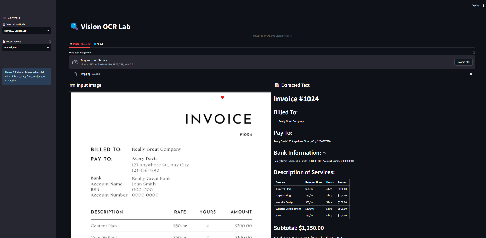
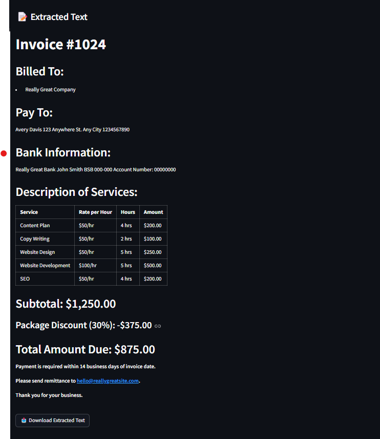

# Ollama OCR 🔍

A powerful OCR (Optical Character Recognition) application that uses state-of-the-art vision language models through Ollama to extract text from images. Built with Streamlit for a modern, user-friendly interface.

## 🌟 Features

- **Multiple Vision Models Support**
  - LLaVA 7B: Efficient vision-language model for real-time processing
  - Llama 3.2 Vision: Advanced model with high accuracy for complex documents

- **Multiple Output Formats**
  - Markdown: Preserves text formatting with headers and lists
  - Plain Text: Clean, simple text extraction
  - JSON: Structured data format
  - Structured: Tables and organized data
  - Key-Value Pairs: Extracts labeled information

- **User-Friendly Interface**
  - Drag-and-drop image upload
  - Real-time processing
  - Download extracted text
  - Image preview with details
  - Responsive design

## 🚀 Getting Started

### Prerequisites

1. Install [Ollama](https://ollama.ai/)
2. Pull the required models:
```bash
ollama pull llava:7b
ollama pull llama3.2-vision:11b
```

### Installation

1. Clone the repository:
```bash
git clone https://github.com/imanoop7/Ollama-OCR.git
cd Ollama-OCR
```

2. Install the required Python packages:
```bash
pip install -r requirements.txt
```

### Running the Application

1. Start the Ollama server (make sure it's running)
2. Run the Streamlit app:
```bash
streamlit run app.py
```

## 💡 Usage Guide

1. **Select Vision Model**
   - Choose between LLaVA 7B (faster) or Llama 3.2 Vision (more accurate)
   - Each model has its strengths for different types of images

2. **Choose Output Format**
   - Markdown: Best for documents with headers and lists
   - Text: Simple text extraction
   - JSON: Structured data output
   - Structured: For tables and organized content
   - Key-Value: For forms and labeled data

3. **Upload Image**
   - Drag and drop or click to upload
   - Supported formats: PNG, JPG, JPEG, TIFF, BMP

4. **View Results**
   - See the extracted text in your chosen format
   - Download the results as a text file

## 🛠️ Technical Details

### Architecture

- **Frontend**: Streamlit
- **Backend**: Python
- **Vision Models**: Ollama API
- **Image Processing**: PIL (Python Imaging Library)

### File Structure

```
OCR-Powerd-By-Ollama-Model/
├── app.py              # Streamlit UI and main application
├── ocr_processor.py    # OCR processing logic and model interaction
├── requirements.txt    # Python dependencies
└── README.md          # Documentation
```

### Key Components

1. **OCR Processor**
   - Handles image encoding
   - Manages model communication
   - Processes different output formats
   - Error handling and response formatting

2. **Streamlit Interface**
   - Responsive UI components
   - Real-time processing
   - File handling
   - Result display and formatting

## 📋 Output Format Details

1. **Markdown Format**
   - Headers for titles and sections
   - Bullet points for lists
   - Proper markdown syntax
   - Preserved text hierarchy

2. **Plain Text**
   - Original layout preservation
   - Line breaks maintained
   - Raw text content

3. **JSON Format**
   - Structured data output
   - Hierarchical organization
   - Machine-readable format

4. **Structured Format**
   - Table extraction
   - List formatting
   - Section organization

5. **Key-Value Format**
   - Form field extraction
   - Labeled data pairs
   - Clear key-value separation

## 📸 Input Image


## 📸 Sample Outputs



 



## 🤝 Contributing

Contributions are welcome! Please feel free to submit a Pull Request.

## 📝 License

This project is licensed under the MIT License - see the LICENSE file for details.

